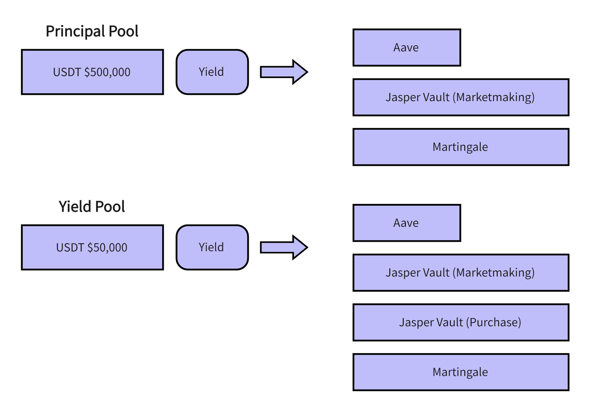

# ⛏️ Liquidity Mining

## 💻 Decentralized Asset Management Process

<figure><figcaption></figcaption></figure>

1. **📱 User Participation in Liquidity**:
   * Users delegate their liquidity assets to nodes for mining.
   * Users can also choose to directly participate in the platform's ecosystem mining.
2. **📶 Node Operations**:
   * After receiving users' liquidity assets, nodes deposit them into a principal pool.
   * Funds in the principal pool are partly authorized for trading and invested in various ecosystem clusters, including third-party and self-built ecosystem products such as Aave, JasperVault, and Martingale.
3. **🥇 Revenue Pool**:
   * A portion of the revenue generated by the ecosystem clusters goes into the revenue pool.
   * After deducting a portion of the revenue as fees, the funds in the revenue pool are distributed to users according to a certain ratio.
4. **💸 User Earnings**:
   * Users can withdraw their assets at any time according to the scheduled withdrawal rules.

## User Delegation Management

<figure><figcaption></figcaption></figure>

On the delegation management page, users can view their assets, position pool, and withdrawable asset status in real-time. Users can withdraw their assets at any time according to the scheduled withdrawal rules.

### Position Pool

The position pool is a part of liquidity delegation, specifically designed to ensure that users can redeem funds at any time. Here is a brief explanation of the position pool:

* **Liquidity Assurance**: The position pool ensures that a portion of the funds is always available, allowing users to quickly redeem their shares for USDT whenever needed.
* **Ratio Setting**: Each node sets a position pool ratio, such as 15%, meaning that 15% of the node's total value will always be maintained in the position pool for redemption. This ratio is not fixed and can be adjusted as needed.
* **Low-Risk Management**: Funds in the position pool mainly come from the principal pool to ensure sufficient liquidity. Funds in the position pool are not involved in any investment operations. Its sole purpose is to maintain enough liquidity to ensure that users can redeem at any time.

### Scheduled Withdrawal Rules

* **Scheduled Withdrawal**: When users need to redeem funds, they must first schedule a withdrawal. The scheduled withdrawal locks the corresponding amount at the current share price, but the funds will only become withdrawable if there are sufficient funds in the position pool.
* **Waiting for Funds to Return to the Position Pool**: If there are not enough funds in the position pool, the user's withdrawal request will be locked until sufficient funds return to the position pool. During this period, nodes may gradually replenish the position pool through low-risk investments to ensure that users' scheduled requests can become withdrawable as soon as possible.
* **Withdrawal Operation**: Once the scheduled withdrawal amount has sufficient funds in the position pool, users will see this amount in the "withdrawable amount" and can immediately withdraw it. This mechanism ensures that users can safely and flexibly manage their funds at any time.

### Advantages of Liquidity Mining

* **High Returns**: By participating in ecosystem mining, users can earn additional TRO token rewards and revenue shares.
* **High Flexibility**: Users can choose to delegate nodes for mining or participate on their own, flexibly adjusting their investment strategies.
* **Security and Transparency**: All operations are executed through smart contracts, ensuring fund security and operational transparency.
